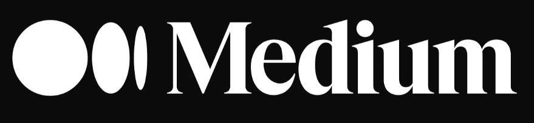

<h1 align="center">
    
</h1>

<h2 align="center">
  Medium clone
</h2>

<p align="center">
 

  
</p>

<p align="center">
  <a href="#-tecnologias">Tecnologias</a>&nbsp;&nbsp;&nbsp;|&nbsp;&nbsp;&nbsp;
  <a href="#-projeto">Projeto</a>&nbsp;&nbsp;&nbsp;|&nbsp;&nbsp;&nbsp;
  <a href="#instalação">Instalação</a>
</p>


## 🚀 Tecnologias

Esse projeto foi desenvolvido com as seguintes tecnologias:

- [Next.js](https://nextjs.org/)

## 💻 Projeto
**Clone do medium usando Next.js no front para SSR e Django com Wagtail para CMS no backend.**

## Instalação
### Pré requisitos
Ter instalado:
- [Node](https://nodejs.org/en/download/)
- [Yarn](https://classic.yarnpkg.com/en/docs/install/)


#### No terminal, rodar
```sh
# Clonar esse repositório
git clone https://github.com/andre23arruda/medium-clone

# Entrar na pasta dos arquivos do frontend
cd medium-clone

# Talvez seja necessário mudar seu baseURL em api.ts

# Instalar os pacotes do projeto
yarn install

# Rodar
yarn dev
```

<h1 align="center">
    

<h1 align="center">
    
